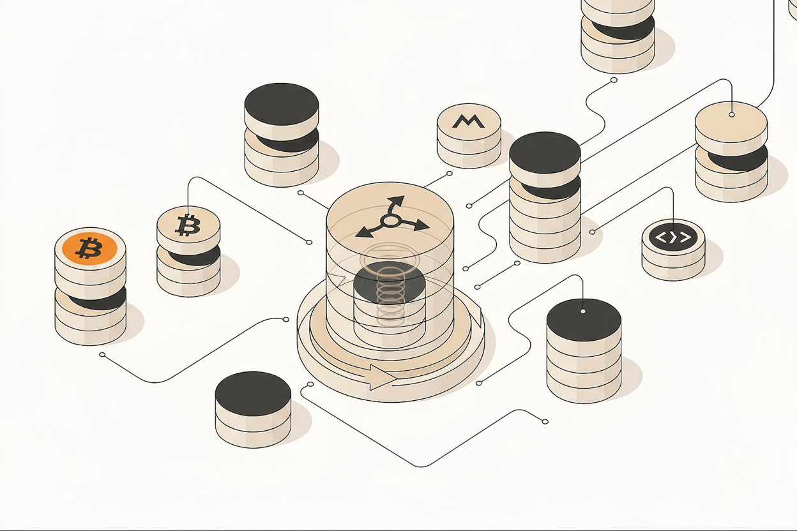

# 🚀 StreamFi — Real-Time Crypto Payroll Platform  



> **Automate salary streaming with blockchain. Pay employees by the second, not by the month.**

**StreamFi** is a decentralized application (DApp) that revolutionizes payroll by enabling **real-time cryptocurrency salary streaming**.  
Built on Ethereum using **Solidity smart contracts**, StreamFi automates continuous payments so employees can **claim their earnings instantly — anytime, anywhere**.

---

## 📋 Table of Contents  

- [🔥 The Problem](#-the-problem)  
- [✅ Our Solution](#-our-solution)  
- [🌟 Key Features](#-key-features)  
- [🛠️ Tech Stack](#️-tech-stack)  
- [📁 Project Structure](#-project-structure)  
- [🚀 Getting Started](#-getting-started)  
- [🎯 How It Works](#-how-it-works)  
- [🔐 Smart Contract Details](#-smart-contract-details)  
- [🐛 Troubleshooting](#-troubleshooting)  
- [🚀 Future Enhancements](#-future-enhancements)  
- [👥 Contributors](#-contributors)  
- [📜 License](#-license)  
- [🙏 Acknowledgments](#-acknowledgments)

---

## 🔥 The Problem  

Traditional payroll systems are **slow, expensive, and outdated**:  

- 💸 **Delayed Payments** — Employees must wait weeks or months to receive salaries [web:51][web:54]  
- 💰 **High Transaction Costs** — Banks and processors charge hefty international fees  
- 🔍 **Lack of Transparency** — Employees have no real-time visibility of earned income  
- 🧾 **Manual Processes** — Payroll teams face errors and inefficiencies [web:54]  
- 🌐 **Cross-Border Challenges** — Global payments mean compliance issues & currency losses [web:51]  

> Industry research highlights **decentralized payroll challenges** such as lack of standardization, compliance risks, and uneven tech adoption [web:51][web:54].

---

## ✅ Our Solution  

Introducing **StreamFi** — where money flows **continuously** like a stream ⛲  

StreamFi enables **money streaming**, allowing salaries to move **second-by-second** via blockchain [web:45][web:52].  

### 💡 Why Money Streaming?  

- ⚡ **Real-Time Payments** — Earn every second, withdraw anytime [web:45]  
- 🔗 **Zero Intermediaries** — Wallet-to-wallet payments via smart contracts  
- 🔍 **Transparent & Auditable** — Fully on-chain payment visibility  
- 🌎 **Global Accessibility** — Works across borders seamlessly [web:46][web:47]  
- 💸 **Cost-Efficient** — No bank or processor fees  

> Inspired by [Superfluid](https://superfluid.finance), the protocol for “streams of money” enabling real-time cashflows on-chain [web:45].

---

## 🌟 Key Features  

### 👩‍💼 For Employees  
- ⏱ **Real-Time Balance Updates** — Watch your salary grow every second  
- 💰 **Instant Claiming** — Withdraw earned tokens anytime  
- 📊 **Transaction History** — Track every claim with timestamps  
- 🔐 **Secure & Decentralized** — You control your funds  

### 🏢 For Employers  
- 🤖 **Automated Streaming** — Set token rates, let contracts handle payments  
- 📉 **Lower Costs** — Eliminate processor and transaction fees  
- 🌍 **Global Payroll** — Pay anyone, anywhere  
- 📜 **Transparent Records** — All transactions on-chain  

---

## 🛠️ Tech Stack  

### 🖥️ **Frontend**  
- HTML5, CSS3, JavaScript  
- **Ethers.js** — Ethereum wallet integration  

### ⚙️ **Blockchain**  
- **Solidity** — Smart contract language  
- **Truffle Suite** — Development, testing, deployment [web:50][web:53]  
- **Ganache** — Local blockchain for simulation [web:50]  

### 🔧 **Development Tools**  
- **Node.js** & **npm** — Environment and package manager  
- **Web3.js** — Blockchain interaction library  
- **Git** — Version control  

---

## 📁 Project Structure  


---

## 🚀 Getting Started  

### 🧩 Prerequisites  

Ensure you have:  
- **Node.js (v16+)** → [Download](https://nodejs.org/)  
- **npm** → Comes with Node.js  
- **Ganache** → [Download](https://trufflesuite.com/ganache/)  
- **MetaMask** → [Install](https://metamask.io/)  
- **Git** → [Download](https://git-scm.com/)  

---

### ⚡ Installation Steps  

#### 1️⃣ Clone the Repository  
```bash
git clone https://github.com/iceman2100/StreamFi_Project.git
cd StreamFi_Project
2️⃣ Install Dependencies
bash
Copy code
npm install
This installs Truffle, Web3.js, Ethers.js, and the Solidity compiler.

3️⃣ Start Ganache
Open Ganache → Quickstart

Copy RPC URL: http://127.0.0.1:7545

4️⃣ Configure Truffle
Check truffle-config.js:

javascript
Copy code
module.exports = {
  networks: {
    development: {
      host: "127.0.0.1",
      port: 7545,
      network_id: "*"
    }
  },
  compilers: {
    solc: { version: "0.8.0" }
  }
};
5️⃣ Compile Smart Contracts
bash
Copy code
truffle compile
✅ Generates StreamFi.json ABI file.

6️⃣ Deploy Contracts
bash
Copy code
truffle migrate --reset
✅ Deployed contract address will appear — save it!

7️⃣ Connect Frontend
In Frontend/index.html:

js
Copy code
const contractAddress = "PASTE_YOUR_CONTRACT_ADDRESS_HERE";
8️⃣ Run the App
Option 1: open Frontend/index.html directly in your browser
Option 2 (recommended):

bash
Copy code
npx live-server Frontend/
App runs at http://localhost:8080 🎉

🎯 How It Works
🧠 Architecture
scss
Copy code
┌─────────────┐       ┌──────────────┐       ┌──────────────┐
│  Employee   │◄──────┤   Smart      │◄──────┤   Employer   │
│   Wallet    │       │  Contract    │       │   Wallet     │
│ (MetaMask)  │──────►│ (StreamFi)   │──────►│ (Ganache)    │
└─────────────┘       └──────────────┘       └──────────────┘
          ▲
          │ Blockchain
          ▼
   Token Streaming Rate (e.g., 4 tokens/sec)
🪙 Payment Flow
1️⃣ Employer sets the streaming rate (e.g., 4 tokens/sec)
2️⃣ Employee logs in to start the stream
3️⃣ Balance grows every second
4️⃣ Employee clicks “Claim Now” to withdraw
5️⃣ Transaction confirmed via MetaMask
6️⃣ Balance resets and stream continues

🔐 Smart Contract Details
📄 StreamFi.sol Overview
Handles:

Employee streaming rates

Login/logout states

Balance computation

Claim processing

⚙️ Core Functions
solidity
Copy code
function setRate(address employee, uint256 rate) public onlyOwner;
function login() public;
function logout() public;
function claim() public;
function getBalance(address employee) public view returns (uint256);
🐛 Troubleshooting
Issue	Solution
❌ Cannot connect to Ganache	Ensure Ganache is running & check RPC at 127.0.0.1:7545
❌ Contract not deployed	Run truffle migrate --reset
❌ MetaMask transaction failed	Import Ganache account private key into MetaMask
❌ Balance not updating	Verify contract address & login before claiming

🚀 Future Enhancements
 Support multiple tokens (USDT, USDC, DAI)

 Employer dashboard

 Mainnet & Layer-2 support (Polygon, BSC)

 React Native mobile app

 Tax automation & bonuses

 Integration with Superfluid protocol [web:45]

👥 Contributors
👤 Anirudh — Project Lead
🔗 GitHub

📜 License
Licensed under the MIT License.

🙏 Acknowledgments
Truffle Suite — Smart contract development [web:50][web:53]

Superfluid — Real-time money streaming [web:45]

OpenZeppelin — Secure Solidity libraries

💡 Built with ❤️ for the decentralized future of payroll.
